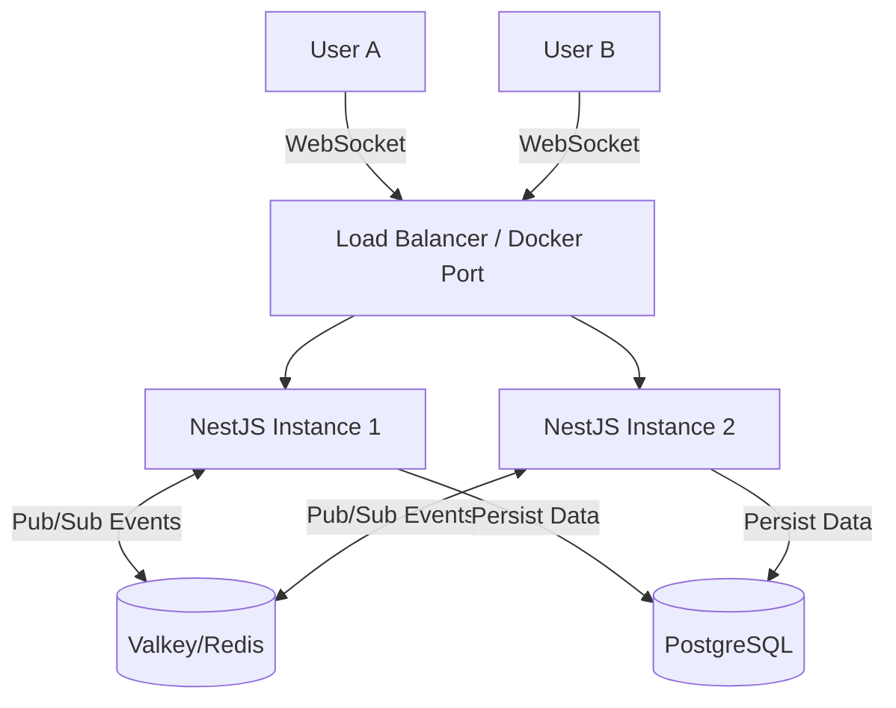

# 🚀 SyncBoard - Realtime Kanban Backend

SyncBoard is a scalable, real-time collaboration platform backend built with **NestJS**, designed to handle high-concurrency WebSocket connections using **Valkey (Redis)** adapter.


## 🏗️ Architecture

The system uses a **Pub/Sub architecture** to allow horizontal scaling. WebSocket events are distributed across multiple server instances via Valkey (Redis fork).


## 🔥 Key Features
- Real-time Synchronization: Using Socket.io with Rooms support.

- Scalable Architecture: Integrated @socket.io/redis-adapter using Valkey for multi-server communication.

- Optimized Database: Using Prisma ORM with connection pooling.

- Smart Ordering: Implements Lexorank-style (Floating point) logic for efficient Drag-and-Drop persistence (O(1) complexity).

- Dockerized: Fully containerized environment (App + DB + Cache) using Multi-stage builds.

## 🛠️ Tech Stack
- Framework: NestJS (Node.js)

- Database: PostgreSQL 15

- ORM: Prisma

- Cache/PubSub: Valkey (Open Source Redis alternative)

- Container: Docker & Docker Compose

## 🚀 Getting Started
You don't need to install Node.js or PostgreSQL locally. Just use Docker.

### Prerequisites
Docker & Docker Compose installed.

### Run the App
```Bash

# 1. Clone the repo
git clone [https://github.com/username/syncboard.git](https://github.com/username/syncboard.git)
cd syncboard

# 2. Start the magic (Builds App, DB, and Valkey)
docker-compose up --build
```
The API will be available at http://localhost:3000.

## 🧪 How to Test (WebSocket)
- Open client-test.html in your browser.

- Enter a Board ID (e.g., board-1) and click Join.

- Open another tab, join the same Board ID.

- Send a message or simulate a Card Move.

- Watch the real-time magic happen across tabs!

## 📂 Project Structure
```bash
src/  
├── boards/          # Module for Board & Card logic (Gateway + Controller)  
├── prisma/          # Global Prisma Database Module  
├── redis-io.adapter # Custom Adapter for Valkey/Redis connection  
├── app.module.ts    # Main Application Module  
└── main.ts          # Entry point  
```

Built with ❤️ by Muhamad Fadlie